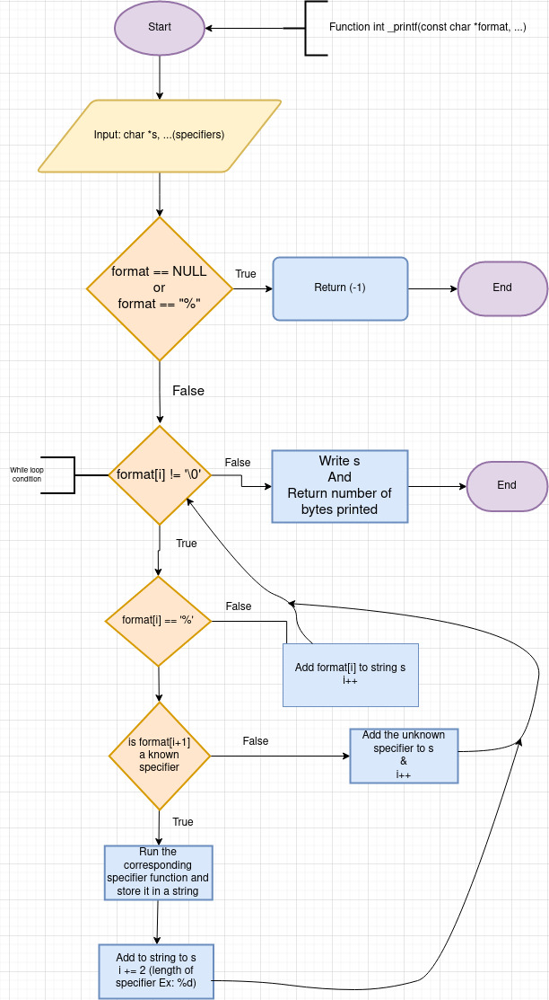

# printf

This is *our* printf right here done in pair programming with the vscode live share pluginmade 100% from scratch!

well appart from some functions.

## Usage

### Prototype:

`int _printf(const char *format, ...);`

where `format` can be a simple string without any specifiers or it can contain specifiers and the arguments corresponding to them.

## Specifiers supported:

| specifier | argument type                                    |
|:----------|:-------------------------------------------------|
| %d        | Print int                                        |
| %i        | Same as %d                                       |
| %c        | Print char                                       |
| %s        | Print string                                     |
| %b        | Print unsigned int as binary                     |
| %u        | Print unsigned int                               |
| %o        | Print unsigned int as octal                      |
| %x        | Print unsigned int as hexadecimal with lowercase |
| %X        | Print unsigned int as hexadecimal with uppercase |

Check out the [Man Page](man_3_printf) for detailed usage.

## Algorithm and logic behind this

### Checkout this flowchart explaining the functions flow

### What each file is for

#### [printf.c](./printf.c)

This is the main function file containing the main logic. 

#### [type_funcs.c](./type_funcs.c)

This file contains the functions to handle each argument type.

#### [std_funcs.c](./std_funcs.c)

This file contains some general purpose functions some are clones of standard c functions.

## Testing

Thet [test](test) directory contains the different tests in test.c format.

To run tests do:

`./exec.sh [test name]`

check [exec.sh](./test/exec.sh) to see the tests format.

## Functions used

* write
* malloc
* free
* va_start
* va_end
* va_copy
* va_arg

